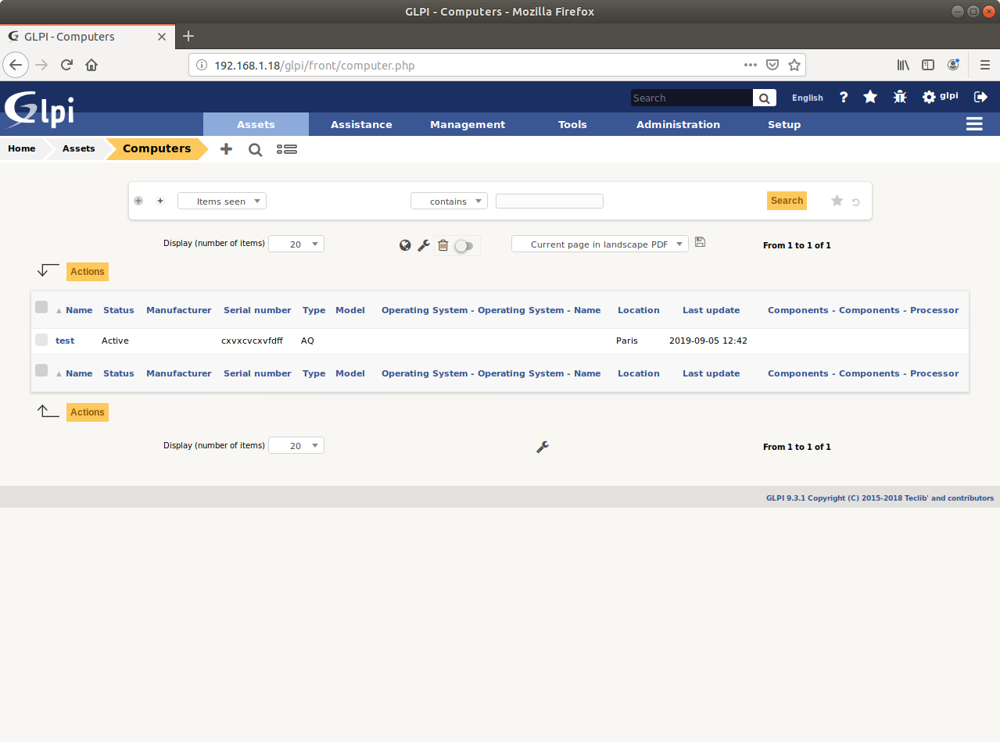
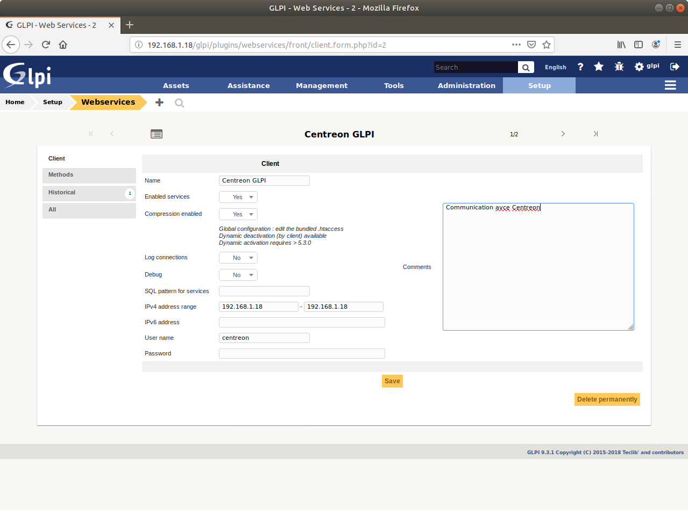
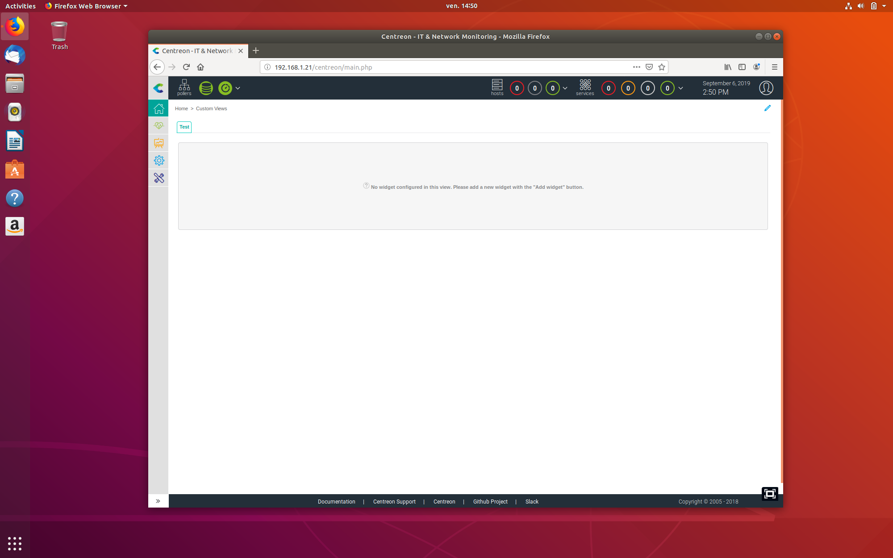
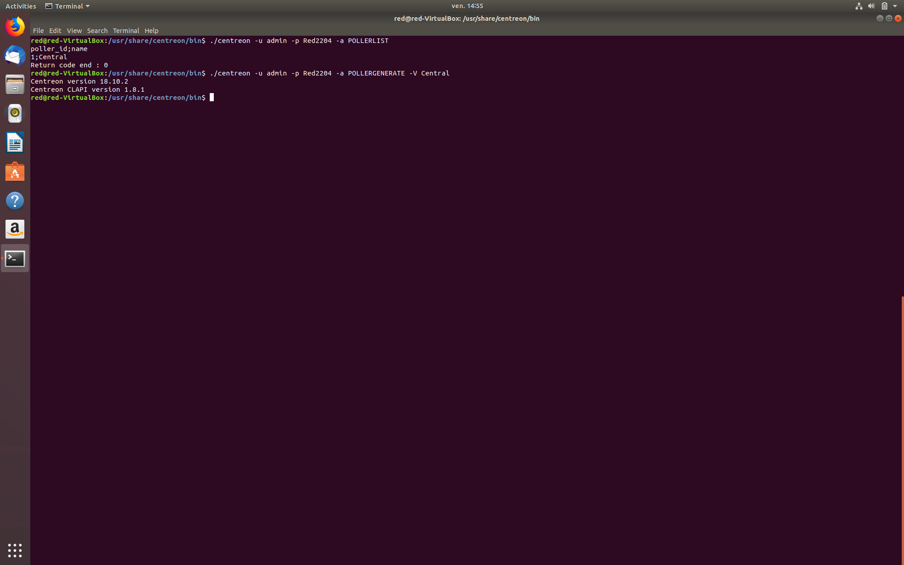
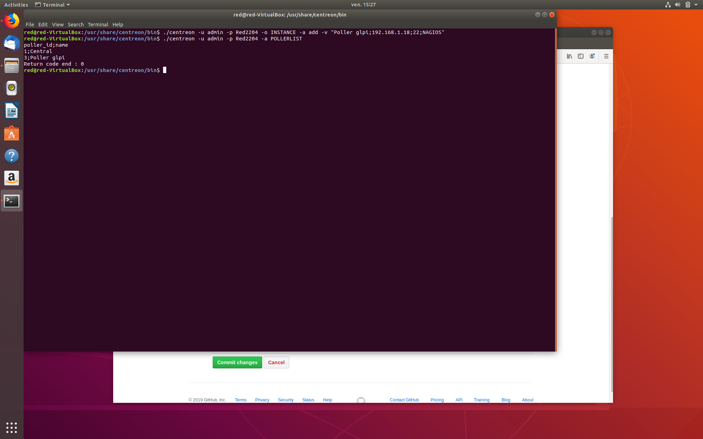

# glpi-centreon
Bonjour, 

#Supervision GLPI par Centreon#

Installation des 2 Machines virtuelles OK -> Ubuntu 18.04 pour les deux.  
Glpi ->( OK (Installation du plugin WebServices semble être OK)     

  
La plage d'adresses renseignée sera celle utilisée par le Poller Centreon.  

  
    
#Centreon#
J'ai installé le logiciel plutôt que d'utiliser les images au format .ovf parceque j'ai cru lire que le module centreon-clapi était désormais inclus dans centreon-web et aussi je souhaitais pouvoir me passer du module centreon-glpi pour la communication puisque il est incompatible avec les nouvelles versions de Glpi et Clapi.  
Je rencontre quelques problemes avec l'installation de Centreon et de ses modules historiques récemment supprimés   

Installation du module centreon-clapi OK  

Ajout d'un poller vers le server GLPI  

Reste à faire Installer les modules manquants et surtout apprendre comment Superviser les instances Glpi de Centreon
Ce n'est donc pas encore exploitable...
